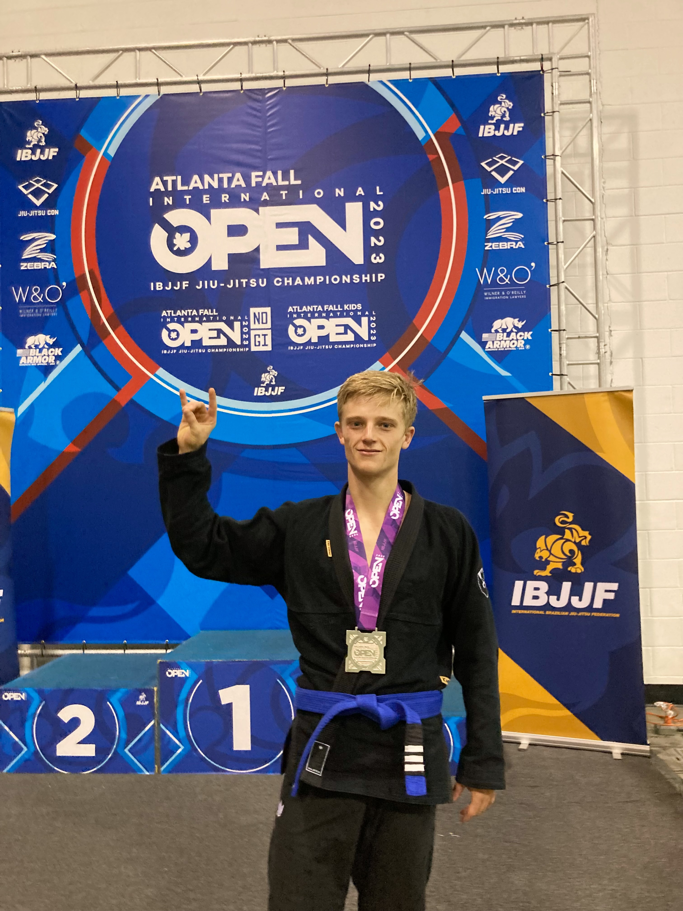
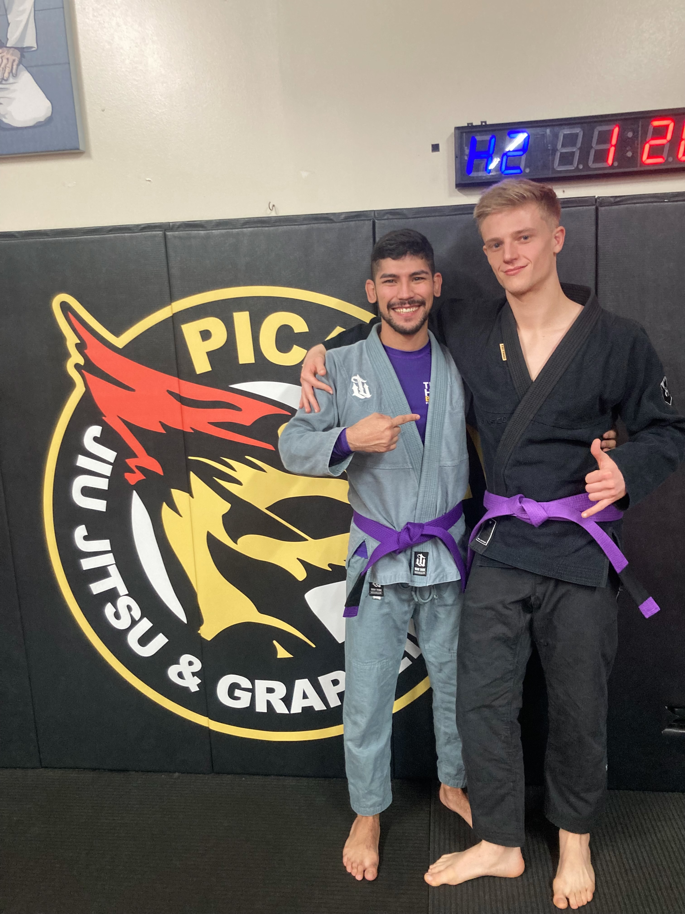
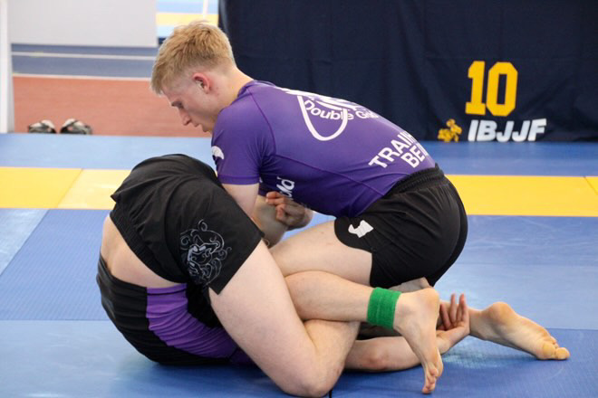
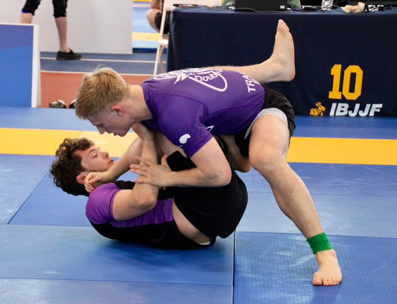
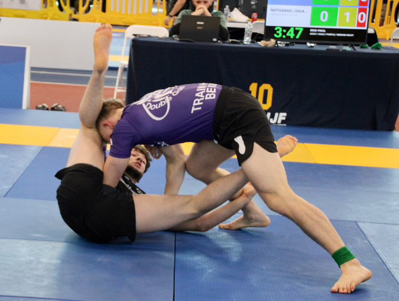

Hi there, I'm Grant Wooley. I'm currently a Senior Data Analyst working in Supply Chain and an avid Brazilian Jiu Jitsu competitor and practitioner.

Thanks so much for checking out my project. Below are some details about my professional skills and my BJJ background.

## [Data Skills:]{.underline}

I've been working in data analytics for roughly **4.5 years**. Having skills in data wrangling, data mining, statistics, and data engineering. I'm very passionate about the data field with aspirations of moving into data engineering in the future. I'm constantly learning and growing my data skills both at work and at home. Having taken courses and read technical books in my free time.

I'm also currently a **part-time Computer Science student at Colorado State University**, completing my degree online while working full-time as a **Senior Data Analyst**.\
\
My primary programming languages are:

-   **Python**

-   **R**

-   **SQL**

I've worked extensively with all three in a professional setting and primarily use Python over R as of late, but R still holds a special place in my heart as my favorite language.

For visualization software I've worked with:

-   **Power BI**

-   **Tableau**

Having built dashboards in both for telling data driven stories and more easily communicating insights to stakeholders.

Uniquely for an analyst I also regularly do shell scripting using:

-   **CMD**

-    **PowerShell**

-    **Bash**

I'm highly skilled with **Excel** although I now primarily use it for ad hoc analysis and quick exploratory work.

## [My Jiu Jitsu Journey:]{.underline}

As of Jan 2026 I've been training BJJ for a little over five years. I started training in Colorado Springs, Co before moving to Chicago, IL as a blue belt. In my first four years I was a very active competitor, competing several times a year, traveling all over the USA, and having done 20+ competitions. I plan to begin competing more regularly again in 2026.

In the last two years I've began teaching at my gym when our main instructors are unable to teach due to travel, sickness, etc... I've found I have a true passion for teaching and hope to continue to get more opportunities to do so in the future.

While, I've always trained and competed in both Gi and No-Gi I have a special passion for the Gi with my favorite technique being the berimbolo.

Jiu Jitsu came into my life during a time where I was dealing with very difficult personal issues. At the time it gave me something positive to focus on and put my energy into. I'm very grateful for what the sport and the community has done for me.\
~\*For\ anyone\ struggling\ with\ mental\ health\ issues\ I\ encourage\ learning\ about\ [TMS](https://en.wikipedia.org/wiki/Transcranial_magnetic_stimulation).~

[**Photos from over the years:**]{.underline}

My proudest tournament result. During my 2nd year at blue belt I spent all year chasing the podium at IBJFF. Falling short several times. In November, I finally reached the podium taking 2nd in a bracket of roughly 20 competitors. I hit many berimbolos that day.

{width="432"}

Getting promoted to purple belt with a close friend in December 2023.

{width="432"}

A few competition photos at IBJJF Chicago as a purple belt.

{width="432"}

{width="432"}

{width="432"}

A recent photo of promotions at my gym in 2026. Celebrating my friend James getting promoted to black belt.

{width="432"}
