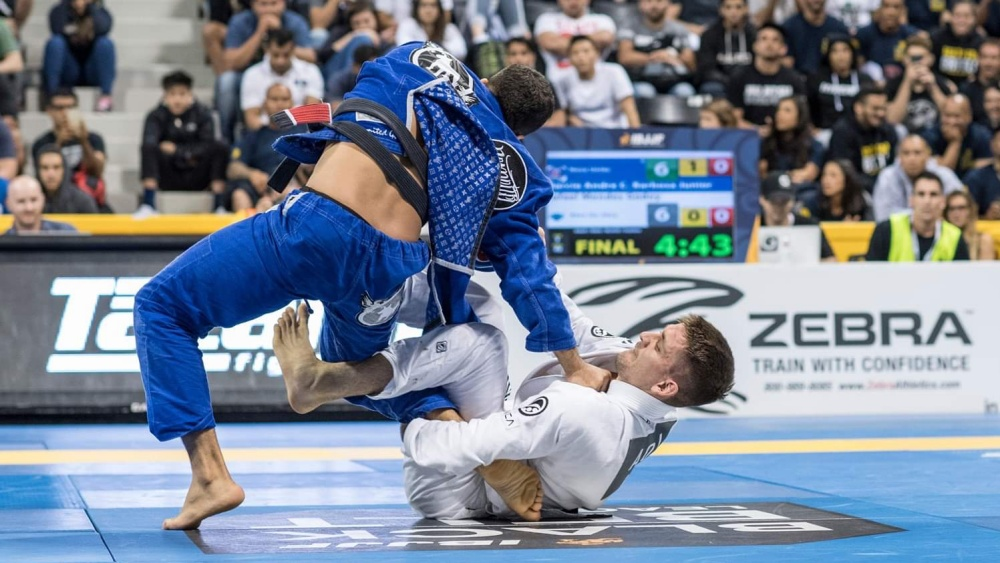
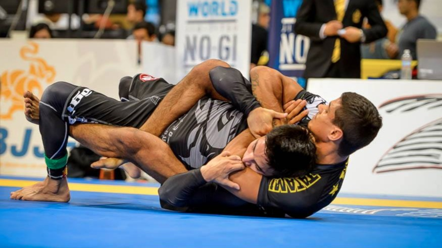
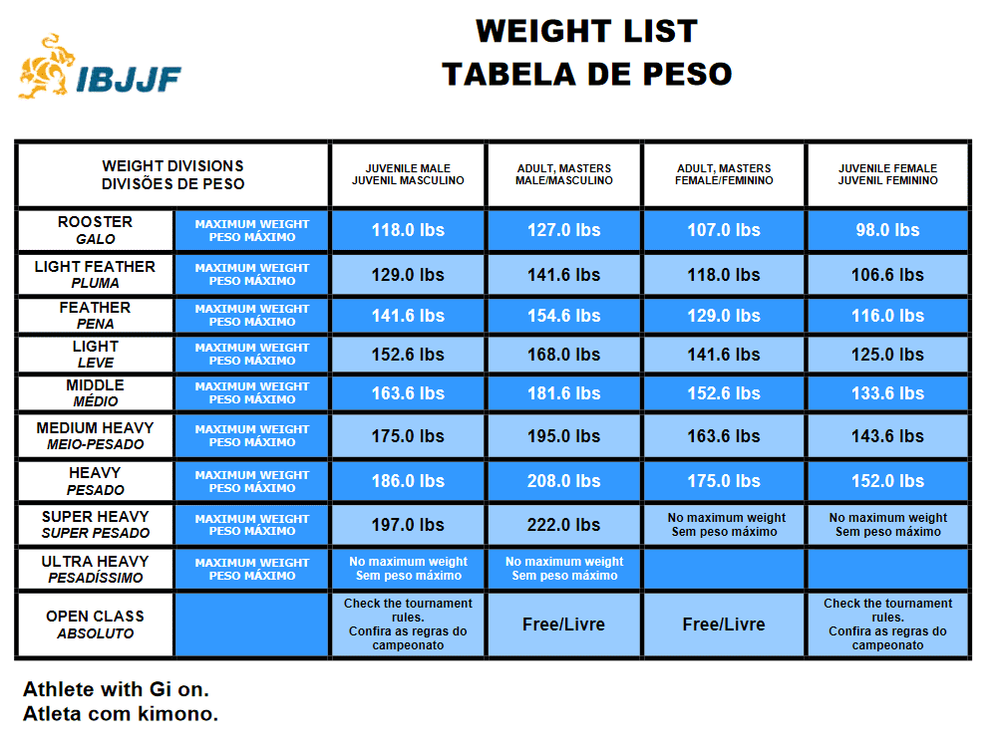
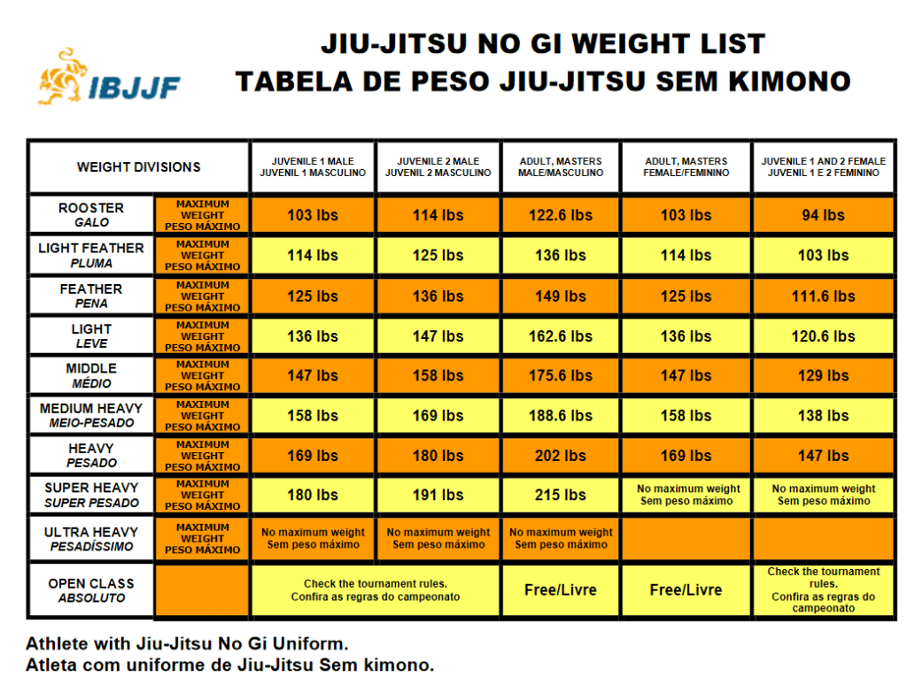

```{r}
#| warning: false
#| message: false
library(dplyr)
source("R/Vars.R")
dt_Absolute_Results <- readRDS(file.path(Path_Data,File_Absolute_Results))

```

---
title: "Data Details"
format: html
editor: visual
---

## [Definitions:]{.underline} 


**Brazilian Jiu Jitsu (BJJ)** - A self-defense system, martial art, and combat sport based on grappling, ground fighting, and submission holds. [Learn More](https://en.wikipedia.org/wiki/Brazilian_jiu-jitsu)

**International Brazilian Jiu-Jitsu Federation (IBJJF)** - The largest and most prestigious tournament organizer in BJJ. [IBJJF Website](https://ibjjf.com/)

**Gi Jiu Jitsu** - In Gi Jiu Jitsu a Gi sometimes called a kimono is worn. Being a heavy-duty uniform consisting of a jacket, pants, and belts. Grabbing or gripping the gi and belt is allowed and used for performing various techniques and submissions. Gi Jiu Jitsu is the older and more traditional form of Jiu Jitsu. Often considered slower and more methodical in comparison to No-Gi due to the gripping involved and is more heavily influenced by [Judo](https://en.wikipedia.org/wiki/Judo) than No-Gi.

{fig-align="center" width="875"}
<span id="def_nogi-anchor"></span>
**No-Gi Jiu Jitsu** - In No-Gi Jiu Jitsu spandex clothing is worn consisting of a rashguard (top), shorts, and sometimes spats (tights). In No-Gi gripping of the uniform is not allowed. No-Gi is considred faster and more dynamic than Gi Jiu Jitsu, has a wider range of legal submissions (leglocks), and is more heavily influenced by [Wrestling](Wrestling) than Gi Jiu Jitsu.

{fig-align="center"}

## [Data Sourcing & Notes:]{.underline}

All data was collected via web scraping the IBJJF Results web pages - <https://ibjjf.com/events/results>

The current data set can be found on kaggle.com here.

how far does the data go back?

#After doing our initial join to get the Weight of our Absolute competitors, we still have a couple hundred records where we do not know the weight #of the absolute competitor. After data exploration I'm seeing two primary reasons. 1. I see some records where a competitor only entered the absolute, and they have no #record for a regular weight division Possibly an IBJJF ruling or exception I'm unfamiliar with. Dealing with these missing weights in a multitude of ways. #2. Sometimes the competitors name was not spelled the same between their weight class entrance and their absolute class entrance.

#For the cases where a competitor does not show up in a regular weight division for the tournament, they often show up in a different tournament under a #weight class. Find their most common weight across all records.

#For the cases where a competitors name is spelled differently between their weight class entrance and their absolue entrance, I will split our competitior name into a First Name, #Last Name, and remaining Name columns (some competitors have many names). Then join in our results using Name, Year, Academy, etc... for each of the 3 naming categories. This should catch a large number #of these spelling errors. Note: I explored using a fuzzy match solution, but this did not work well. #dt_Results %\>% mutate( \# Fname = str_split(Competitor_Name, " ")

#Tournament names are not consistent, need to account for this. I.e. Worlds has 3 different names. Correcting this issue.

#In 2009 for the CAMPEONATO BRASILEIRO DE JIU JITSU tournament. Several Female divisions only had one entrance. They were not given a placing. However by default they would have placed 1st. #Correcting these NAs.

#For Super Heavy Female, and Ultra Heavy Male there is no actual weight defined by IBJJF. It is uncapped, but to make time series #plots work correctly we need to declare an actual weight. I took the average weight difference between each Type/Gender category #combination to set the weight for Super Heavy and Ultra Heavy. This biases some of the analysis in favor of lighter competitors/weights. #I think this bias is acceptable to produce good time series plots.

I had to translate stuff I don't speak portugese I hope google translate did ok.

when does female results change belts divisions?

| Tournamnet                | Purple Brown Black | Brown Black | Black |
|---------------------------|--------------------|-------------|-------|
| Worlds                    | 1999-2004          | 2005-2011   | 2012  |
| Worlds No-Gi              | NA                 | 2007-2011   | 2012  |
| Pans                      | 1999-2005          | 2006-2011   | 2012  |
| Pans No-Gi                | NA                 | 2007-2011   | 2012  |
| Europeans                 | 2004               | 2007-2010   | 2011  |
| Europeans No-Gi           | NA                 | NA          | 2012  |
| Brazilian Nationals       | NA                 | NA          | 1998  |
| Brazilian Nationals No-Gi | NA                 | 2009-2011   | 2012  |

earliest tournament results

| Tournament          | Earliest Gi Year | Earliest No-Gi Year |
|---------------------|------------------|---------------------|
| Worlds              | 1996             | 2007                |
| Pans                | 1996             | 2007                |
| Europeans           | 2004             | 2012                |
| Brazilian nationals | 1994             | 2009                |

## [IBJJF Weight Classes:]{.underline}

#### [Gi Weight Chart]{.underline}



#### [No Gi Weight Chart]{.underline}


